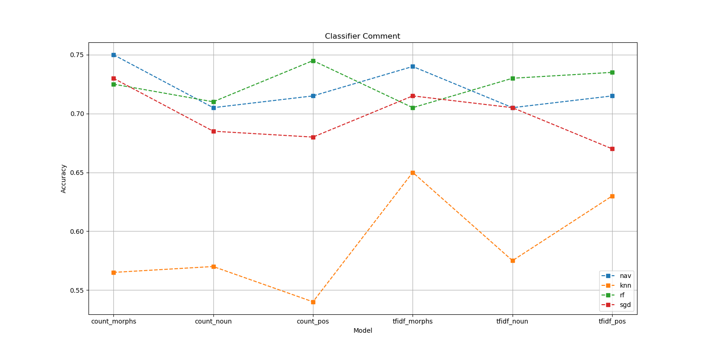

# TF-IDF 사용한 데이터 전처리

## Introduce
> twitter-korean-text를 사용하여 형태소를 분류하였다.
> * EX)
> 연애하는 거 꼴보기 싫다.
> ['연애', '하는', '거', '꼴', '보기', '싫다']

> 분리된 형태소 별로 TF-IDF값을 구하여서 값이 큰 값은 데이터에서 제외하였다.
>

## Model

* Doc2vec

> 네가지 결과 현재 Navie Bayes가 성능이 제일 좋았다.

## TODO

> threshold 별로 성능비교.

